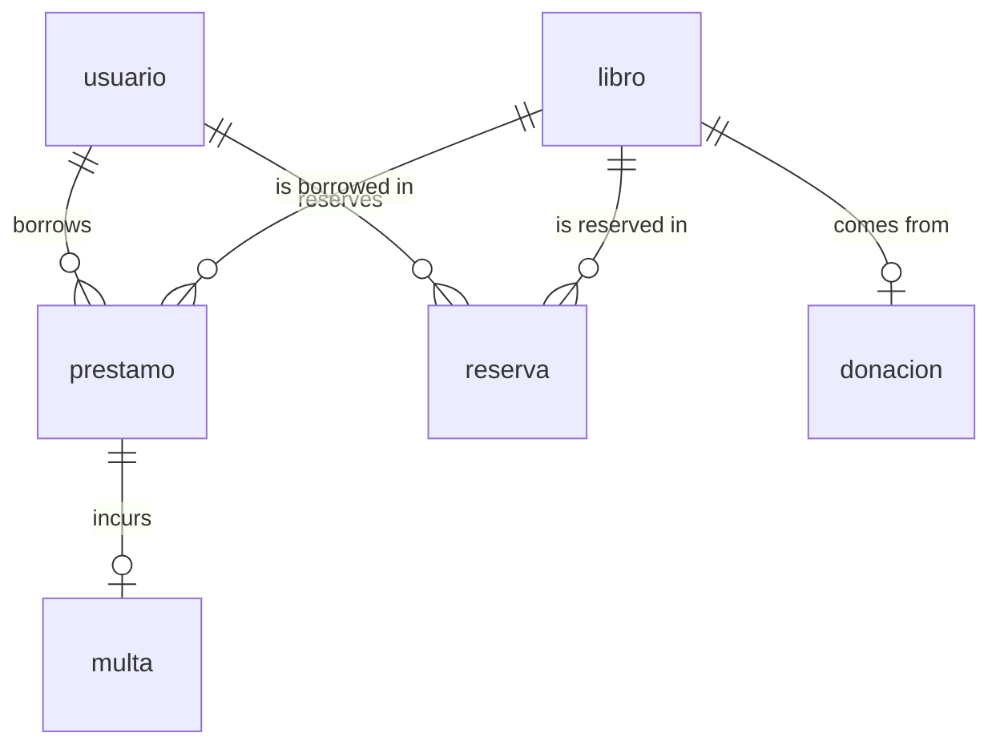

The SQLite database is stored as `biblioteca.db` in the working directory. All tables are created automatically on first connection by `crear_tablas(conn)` in `Modelo/conexion.py`. The function uses `CREATE TABLE IF NOT EXISTS` for each table, so calling it repeatedly is safe.

<Note>
  Foreign key enforcement is activated on every connection with `PRAGMA foreign_keys = ON`. This applies both to `crear_conexion()` in `Modelo/conexion.py` and to `ControladorBiblioteca.conectar()` in the controller.
</Note>

## Tables

### usuario

```sql
CREATE TABLE IF NOT EXISTS usuario (
    id INTEGER PRIMARY KEY AUTOINCREMENT,
    nombre TEXT NOT NULL,
    carrera TEXT NOT NULL
)
```

Stores library members. Every loan and reservation references a row in this table.

<ResponseField name="id" type="integer" required>
  Auto-incremented primary key. Uniquely identifies a library member.
</ResponseField>

<ResponseField name="nombre" type="text" required>
  Full name of the library member. Cannot be null.
</ResponseField>

<ResponseField name="carrera" type="text" required>
  Academic career or programme of the member. Cannot be null.
</ResponseField>

---

### libro

```sql
CREATE TABLE IF NOT EXISTS libro (
    id INTEGER PRIMARY KEY AUTOINCREMENT,
    titulo TEXT NOT NULL,
    autor TEXT NOT NULL,
    isbn TEXT UNIQUE,
    genero TEXT,
    disponible INTEGER DEFAULT 1
)
```

Central catalog of all books, including donated ones. Availability is tracked as a flag updated atomically alongside loan and return operations.

<ResponseField name="id" type="integer" required>
  Auto-incremented primary key.
</ResponseField>

<ResponseField name="titulo" type="text" required>
  Book title. Cannot be null.
</ResponseField>

<ResponseField name="autor" type="text" required>
  Author name. Cannot be null.
</ResponseField>

<ResponseField name="isbn" type="text">
  International Standard Book Number. Optional, but enforced as unique across the table when provided.
</ResponseField>

<ResponseField name="genero" type="text">
  Literary genre. Optional free-text field.
</ResponseField>

<ResponseField name="disponible" type="integer" default="1">
  Availability flag. `1` means the book can be loaned; `0` means it is currently on loan. Defaults to `1`.
</ResponseField>

<Note>
  `isbn` carries a `UNIQUE` constraint. Inserting or updating a book with a duplicate ISBN raises `sqlite3.IntegrityError`.
</Note>

---

### prestamo

```sql
CREATE TABLE IF NOT EXISTS prestamo (
    id INTEGER PRIMARY KEY AUTOINCREMENT,
    usuario_id INTEGER,
    libro_id INTEGER,
    fecha TEXT,
    devuelto INTEGER DEFAULT 0,
    FOREIGN KEY(usuario_id) REFERENCES usuario(id),
    FOREIGN KEY(libro_id) REFERENCES libro(id)
)
```

Records each loan. Creating a loan also sets `libro.disponible = 0`; returning it sets `libro.disponible = 1`. Both changes happen in the same transaction.

<ResponseField name="id" type="integer" required>
  Auto-incremented primary key.
</ResponseField>

<ResponseField name="usuario_id" type="integer">
  Foreign key referencing `usuario.id`. Identifies the borrower.
</ResponseField>

<ResponseField name="libro_id" type="integer">
  Foreign key referencing `libro.id`. Identifies the borrowed book.
</ResponseField>

<ResponseField name="fecha" type="text">
  Loan date stored as a string in `DD/MM/YYYY` format. Used by `calcular_multa()` to compute overdue days.
</ResponseField>

<ResponseField name="devuelto" type="integer" default="0">
  Return flag. `0` = active loan; `1` = returned. Defaults to `0`.
</ResponseField>

<Note>
  Deleting a `usuario` or `libro` row is blocked by the controller if the row has active (unreturned) loans. The foreign keys also enforce referential integrity at the database level when `PRAGMA foreign_keys = ON`.
</Note>

---

### multa

```sql
CREATE TABLE IF NOT EXISTS multa (
    id INTEGER PRIMARY KEY AUTOINCREMENT,
    prestamo_id INTEGER,
    dias_retraso INTEGER,
    monto REAL,
    FOREIGN KEY(prestamo_id) REFERENCES prestamo(id)
)
```

A fine row is inserted automatically by `devolver_libro()` when the loan exceeds 7 days. The fine rate is $1.00 per day beyond the 7-day grace period.

<ResponseField name="id" type="integer" required>
  Auto-incremented primary key.
</ResponseField>

<ResponseField name="prestamo_id" type="integer">
  Foreign key referencing `prestamo.id`.
</ResponseField>

<ResponseField name="dias_retraso" type="integer">
  Total number of days since the loan date at the moment of return.
</ResponseField>

<ResponseField name="monto" type="real">
  Fine amount in currency units. Calculated as `(dias_retraso - 7) * 1.0`, rounded to 2 decimal places.
</ResponseField>

---

### reserva

```sql
CREATE TABLE IF NOT EXISTS reserva (
    id INTEGER PRIMARY KEY AUTOINCREMENT,
    usuario_id INTEGER,
    libro_id INTEGER,
    fecha TEXT,
    estado TEXT
)
```

Queues a user's interest in a currently unavailable book. The controller prevents duplicate pending reservations for the same user–book pair.

<ResponseField name="id" type="integer" required>
  Auto-incremented primary key.
</ResponseField>

<ResponseField name="usuario_id" type="integer">
  References `usuario.id`. Identifies the requesting user.
</ResponseField>

<ResponseField name="libro_id" type="integer">
  References `libro.id`. Identifies the requested book.
</ResponseField>

<ResponseField name="fecha" type="text">
  Date the reservation was made. Inserted as `DATE('now')` via SQLite.
</ResponseField>

<ResponseField name="estado" type="text">
  Current status of the reservation. Inserted as `'Pendiente'`. The controller checks for this value to prevent duplicate reservations.
</ResponseField>

<Note>
  `reserva` rows are deleted automatically (in the same transaction) when the associated `usuario` or `libro` is deleted.
</Note>

---

### donacion

```sql
CREATE TABLE IF NOT EXISTS donacion (
    id INTEGER PRIMARY KEY AUTOINCREMENT,
    libro_id INTEGER,
    donante TEXT,
    fecha TEXT
)
```

Tracks donated books. When a donation is registered, a new `libro` row is created and `donacion.libro_id` links back to it — both inserts happen in one atomic transaction.

<ResponseField name="id" type="integer" required>
  Auto-incremented primary key.
</ResponseField>

<ResponseField name="libro_id" type="integer">
  References the `libro` row created for the donated book.
</ResponseField>

<ResponseField name="donante" type="text">
  Name of the donor.
</ResponseField>

<ResponseField name="fecha" type="text">
  Donation date. Inserted as `DATE('now')` via SQLite.
</ResponseField>

---

## Entity relationships


